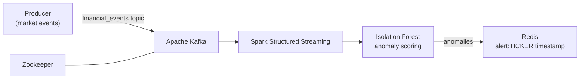

# Real-Time Market Manipulation & Insider Trading Detection Pipeline

A high-throughput streaming pipeline that ingests financial market events, scores them with a machine-learning anomaly detector in real time, and publishes suspicious activity alerts to a low-latency store.

Built with **Apache Kafka**, **Apache Spark Structured Streaming**, **scikit-learn (Isolation Forest)**, and **Redis**.

---

## Architecture



| Component | Role |
|---|---|
| `src/producer.py` | Simulates a live market feed (ticker, price, volume, sentiment) and injects ~5% volume-spike anomalies |
| Kafka + Zookeeper | Durable, scalable event bus |
| `src/streaming_pipeline.py` | Spark job that parses events, runs the ML model per event, and writes alerts |
| Redis | Stores alerts for fast lookup by dashboards / downstream services |

## Event Schema

```json
{
  "ticker": "TSLA",
  "price": 412.37,
  "volume": 245000,
  "sentiment_score": 0.82,
  "timestamp": 1759675200.123
}
```

## Tech Stack

- Python 3.10+
- Apache Kafka 7.4 (Confluent images)
- Apache Spark 3.5 (PySpark)
- scikit-learn 1.3
- Redis
- Docker & Docker Compose

## Getting Started

### Prerequisites
- Docker Desktop
- Python 3.10+
- Java 8/11/17 (required by Spark)
- Windows only: `winutils.exe` and `HADOOP_HOME` configured for Spark

### 1. Clone
```bash
git clone https://github.com/meenub255/Real-Time-Market-Manipulation-Insider-Trading-Detection-Pipeline.git
cd Real-Time-Market-Manipulation-Insider-Trading-Detection-Pipeline
```

### 2. Start infrastructure
```bash
docker compose up -d
docker compose ps
```
Services: Kafka `localhost:9092`, Zookeeper `localhost:2181`, Redis `localhost:6379`.

### 3. Install dependencies
```bash
python -m venv venv
# Windows: venv\Scripts\activate   |   macOS/Linux: source venv/bin/activate
pip install -r requirements.txt
```

### 4. Train the model
```bash
python src/train_model.py
```
Saves `models/isolation_forest.joblib` and prints precision/recall (~0.92 on synthetic data).

### 5. Run the pipeline
```bash
# Terminal 1 – live dashboard  ->  http://localhost:5000
python src/dashboard.py

# Terminal 2 – stream events into Kafka
python src/producer.py

# Terminal 3 – detect anomalies with Spark
python src/streaming_pipeline.py
```

### 6. Inspect alerts
```bash
docker exec -it $(docker compose ps -q redis) redis-cli KEYS "alert:*"
docker exec -it $(docker compose ps -q redis) redis-cli GET "alert:TSLA:1759675200"
```

## Project Structure

```
.
├── docker-compose.yml        # Kafka, Zookeeper, Redis
├── requirements.txt
├── README.md
└── src/
    ├── producer.py           # Mock market event generator
    ├── train_model.py        # Trains & saves the Isolation Forest
    ├── streaming_pipeline.py # Spark streaming + ML detection
    ├── dashboard.py          # Flask + SSE live alert server
    └── dashboard/            # Dashboard UI (HTML/CSS/JS)
```

## Detection Logic

An **Isolation Forest** (200 trees) is trained on 51k synthetic events using scaled `volume` and `sentiment_score`. Events isolated quickly by the model (e.g. abnormal volume spikes) are flagged as potential manipulation or insider activity. Alerts are stored in Redis with a 24h TTL, kept in a capped `alerts:recent` list, and published on the `alerts` Pub/Sub channel, which streams to the dashboard via Server-Sent Events.

> **Note:** Training data is synthetic. For real use, retrain on historical market data.

## Roadmap

- [x] Train the model and persist it
- [ ] Retrain on historical tick data
- [ ] Per-ticker rolling features (z-scores, VWAP deviation, order imbalance)
- [x] Alert TTLs and Redis Pub/Sub for live notifications
- [x] Real-time dashboard
- [ ] Containerize the producer and Spark job

## Stopping

```bash
docker compose down
```

